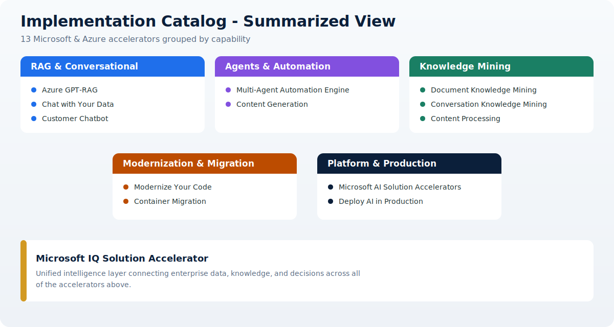

# Architecture Patterns

This page gives you a summarized, at-a-glance view of every option in the [Implementation Catalog](../02-catalog/index.md), grouped by the capability each accelerator delivers. Use it to quickly find the right starting pattern, then open the dedicated landing page for details.

## Catalog at a glance

| Capability | Accelerators | Primary use case |
| --- | --- | --- |
| 🔵 RAG & Conversational | GPT-RAG, Chat with Your Data, Customer Chatbot | Grounded chat over private enterprise data |
| 🟣 Agents & Automation | Multi-Agent Automation Engine, Content Generation | Multi-step orchestration and generative workflows |
| 🟢 Knowledge Mining | Document Knowledge Mining, Conversation Knowledge Mining, Content Processing | Extract structure and insight from unstructured content |
| 🟠 Modernization & Migration | Modernize Your Code, Container Migration | AI-assisted code and platform modernization |
| ⚫ Platform & Production | Microsoft AI Solution Accelerators, Deploy AI in Production | Discovery catalog and secure production baseline |
| 🟡 Unified Intelligence | Microsoft IQ | Cross-cutting intelligence layer over all data |

## Options by capability

  

    <h3>RAG &amp; Conversational</h3>
    <ul>
      <li><a href="../02-catalog/gpt-rag.md">Azure GPT-RAG</a> - secure enterprise RAG baseline</li>
      <li><a href="../02-catalog/chat-with-data.md">Chat with Your Data</a> - reference RAG accelerator</li>
      <li><a href="../02-catalog/customer-chatbot.md">Customer Chatbot</a> - Foundry agent chatbot</li>
    </ul>
  

  

    <h3>Agents &amp; Automation</h3>
    <ul>
      <li><a href="../02-catalog/multi-agent-automation.md">Multi-Agent Automation Engine</a> - coordinated specialist agents</li>
      <li><a href="../02-catalog/content-generation.md">Content Generation</a> - multi-agent marketing content</li>
    </ul>
  

  

    <h3>Knowledge Mining</h3>
    <ul>
      <li><a href="../02-catalog/document-knowledge-mining.md">Document Knowledge Mining</a> - entities, summaries, metadata</li>
      <li><a href="../02-catalog/conversation-mining.md">Conversation Knowledge Mining</a> - insights from conversations</li>
      <li><a href="../02-catalog/content-processing.md">Content Processing</a> - schema extraction from multimodal content</li>
    </ul>
  

  

    <h3>Modernization &amp; Migration</h3>
    <ul>
      <li><a href="../02-catalog/modernize-code.md">Modernize Your Code</a> - SQL modernization and translation</li>
      <li><a href="../02-catalog/container-migration.md">Container Migration</a> - AI-assisted move to AKS</li>
    </ul>
  

  

    <h3>Platform &amp; Production</h3>
    <ul>
      <li><a href="../02-catalog/microsoft-ai-accelerators.md">Microsoft AI Solution Accelerators</a> - official catalog</li>
      <li><a href="../02-catalog/deploy-ai-production.md">Deploy AI in Production</a> - secure Foundry baseline</li>
    </ul>
  

  

    <h3>Unified Intelligence</h3>
    <ul>
      <li><a href="../02-catalog/microsoft-iq.md">Microsoft IQ</a> - unified layer across data, knowledge, and decisions</li>
    </ul>
  

## How to choose

- Start from the capability that matches your use case in the table above.
- Open the accelerator landing page for architecture fit, dependencies, and production considerations.
- Decide whether to adopt as-is, customize, or reuse selected patterns.

!!! tip
    Every accelerator in this summary links to its full landing page in the [Implementation Catalog](../02-catalog/index.md).
