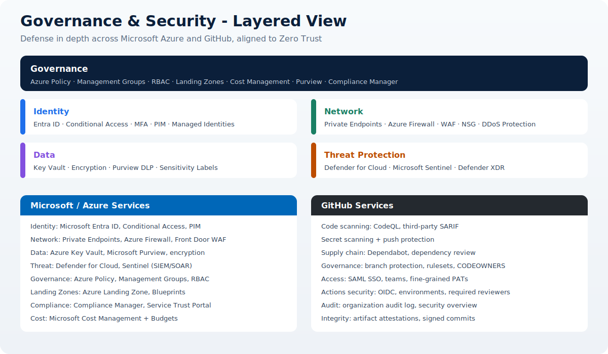

# Governance and Security

This page summarizes the core governance and security concepts for enterprise RAG, and provides a reference catalog of the Microsoft and GitHub services, products, and components you use to implement them.

## Core concepts

| Concept | What it means |
| --- | --- |
| Governance | The policies, roles, standards, and controls that keep workloads compliant, cost-aware, and consistent as you scale. |
| Security | The technical controls that protect confidentiality, integrity, and availability of data and systems. |
| Zero Trust | Never trust, always verify. Every request is authenticated, authorized, and encrypted regardless of network location. |
| Defense in depth | Layered controls (identity, network, data, threat) so no single failure exposes the system. |
| Least privilege | Grant only the access needed, only for as long as needed (JIT/JEA). |
| Shared responsibility | Microsoft secures the cloud platform; you secure your data, identities, and configuration. |
| Landing zone | A pre-governed Azure environment with guardrails that all workloads deploy into. |
| Compliance | Meeting regulatory and internal standards (ISO 27001, SOC 2, GDPR, HIPAA) with evidence. |
| Supply chain security | Securing dependencies, source code, build pipelines, and artifacts end to end. |

## Governing frameworks

- **Zero Trust Architecture (ZTA)** - security strategy; see [04. Security](../04-security/index.md).
- **Cloud Adoption Framework (CAF)** - governance, security, and management disciplines.
- **Well-Architected Framework (WAF)** - the Security and Operational Excellence pillars.

---

## Microsoft and Azure services

### Identity and access

| Service / Component | Purpose |
| --- | --- |
| Microsoft Entra ID | Central identity provider for users, apps, and workloads. |
| Conditional Access | Risk-based access policies (device, location, sign-in risk). |
| Multi-Factor Authentication (MFA) | Second-factor verification for sign-in. |
| Privileged Identity Management (PIM) | Just-in-time, time-bound elevation of privileged roles. |
| Managed Identities | Credential-free identity for Azure resources. |
| Azure RBAC | Fine-grained role assignments on Azure resources. |
| Entra ID Governance | Access reviews, entitlement management, lifecycle. |

### Network protection

| Service / Component | Purpose |
| --- | --- |
| Private Endpoints / Private Link | Private, non-internet access to PaaS services. |
| Azure Firewall | Managed, stateful network firewall with threat intel. |
| Web Application Firewall (WAF) | Protects web apps/APIs (via Front Door or App Gateway). |
| Azure Front Door | Global edge routing, TLS, and WAF. |
| Network Security Groups (NSG) | Subnet/NIC-level traffic filtering. |
| DDoS Protection | Mitigates volumetric and protocol attacks. |
| Azure Virtual Network | Isolated network boundary for workloads. |

### Data protection

| Service / Component | Purpose |
| --- | --- |
| Azure Key Vault | Secrets, keys, and certificate management. |
| Microsoft Purview | Data governance, catalog, classification, and DLP. |
| Sensitivity labels / Information Protection | Classify and protect documents and data. |
| Encryption at rest and in transit | Platform and customer-managed key encryption. |
| Azure confidential computing | Protect data in use with trusted execution environments. |

### Threat protection and monitoring

| Service / Component | Purpose |
| --- | --- |
| Microsoft Defender for Cloud | Cloud security posture management (CSPM) and workload protection. |
| Microsoft Sentinel | Cloud-native SIEM and SOAR for detection and response. |
| Microsoft Defender XDR | Unified threat protection across endpoints, identity, email, apps. |
| Azure Monitor / Log Analytics | Centralized logging, metrics, and alerting. |

### Governance and management

| Service / Component | Purpose |
| --- | --- |
| Azure Policy | Enforce and audit resource compliance at scale. |
| Management Groups | Hierarchy for organizing subscriptions and policy scope. |
| Azure Landing Zones | Enterprise-scale governed environment blueprint. |
| Azure Blueprints | Repeatable environment definitions (being succeeded by specs/Terraform). |
| Microsoft Cost Management + Budgets | Cost visibility, allocation, and controls. |
| Microsoft Purview Compliance / Compliance Manager | Assess and manage regulatory compliance. |
| Service Trust Portal | Microsoft audit reports and compliance documentation. |

---

## GitHub services

### Code and supply chain security (GitHub Advanced Security)

| Service / Component | Purpose |
| --- | --- |
| CodeQL code scanning | Static analysis to find vulnerabilities in code. |
| Secret scanning + push protection | Detect and block committed credentials and tokens. |
| Dependabot alerts and updates | Detect and patch vulnerable dependencies. |
| Dependency review | Flag risky dependency changes in pull requests. |
| Security overview | Org-wide view of alerts and coverage. |

### Repository and organization governance

| Service / Component | Purpose |
| --- | --- |
| Branch protection rules / Rulesets | Enforce reviews, status checks, and merge policies. |
| CODEOWNERS | Require owner review for specific paths. |
| Required reviewers and status checks | Gate merges on approvals and passing CI. |
| Organization and repository roles | Least-privilege access to repos and settings. |
| Fine-grained personal access tokens | Scoped, expiring API access. |

### Identity, access, and auditing

| Service / Component | Purpose |
| --- | --- |
| SAML single sign-on (SSO) | Centralized enterprise authentication. |
| Team-based access management | Map org teams to repository permissions. |
| Organization audit log | Track configuration and access events. |
| Signed commits (GPG/SSH) | Verify author identity and commit integrity. |

### Pipeline and artifact security

| Service / Component | Purpose |
| --- | --- |
| GitHub Actions OIDC | Credential-free, federated auth to Azure. |
| Environments and required reviewers | Approvals and secrets scoping for deployments. |
| Encrypted Actions secrets | Secure storage of pipeline secrets. |
| Artifact attestations | Build provenance for supply chain integrity. |

---

!!! tip
    Pair these controls with the [Zero Trust Architecture](../04-security/index.md) page: identity, network, data, and monitoring services above are the concrete implementation of the Zero Trust principles.
