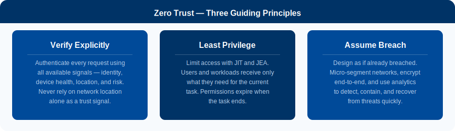
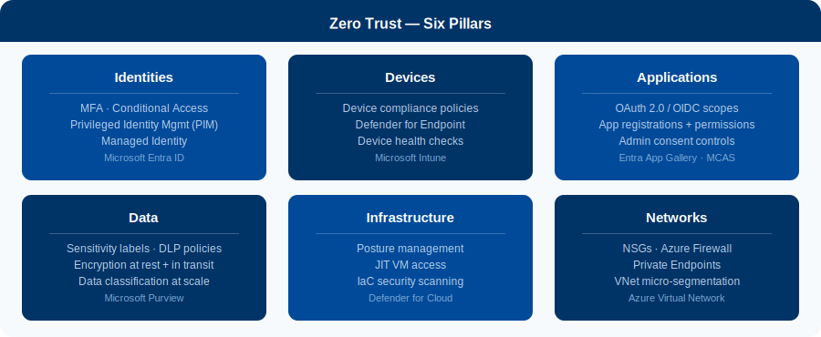
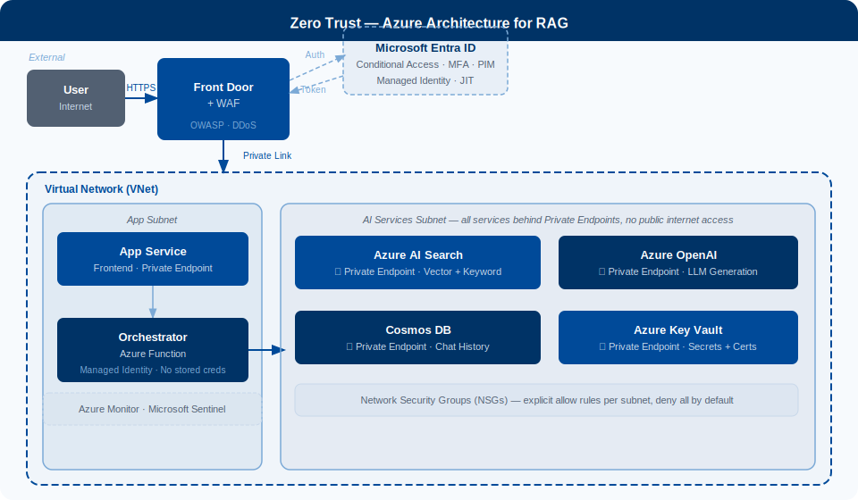
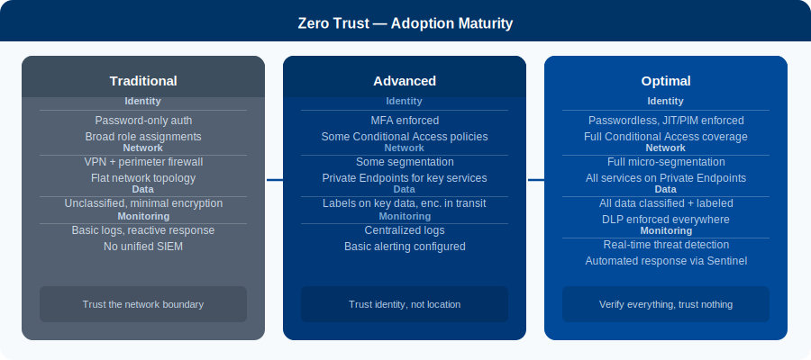

# Zero Trust Architecture

----------

<b>References</b> (Click to expand)

- [Zero Trust defined - Microsoft Security](https://www.microsoft.com/en-us/security/business/zero-trust)
- [Apply Zero Trust principles to Azure IaaS - Microsoft Learn](https://learn.microsoft.com/en-us/security/zero-trust/azure-infrastructure-overview)
- [Zero Trust Essentials eBook](https://cdn-dynmedia-1.microsoft.com/is/content/microsoftcorp/microsoft/final/en-us/microsoft-brand/documents/zero-trust-essentials-ebook.pdf)
- [Conditional Access overview - Microsoft Learn](https://learn.microsoft.com/en-us/entra/identity/conditional-access/overview)
- [Azure Private Link and Private Endpoints](https://learn.microsoft.com/en-us/azure/private-link/private-endpoint-overview)
- [Defender for Cloud introduction](https://learn.microsoft.com/en-us/azure/defender-for-cloud/defender-for-cloud-introduction)
- [Microsoft Purview - Data governance](https://learn.microsoft.com/en-us/purview/purview)
- [Microsoft Sentinel - SIEM/SOAR](https://learn.microsoft.com/en-us/azure/sentinel/overview)
- [GPT-RAG Zero Trust Architecture - Azure GitHub](https://github.com/Azure/GPT-RAG)

## What It Is

> Zero Trust is a security model built on one principle: `never trust, always verify`. Every request - from a user, a service, or a device - must prove its identity and meet policy before it is granted access to any resource, `regardless of where it originates`.

Traditional security drew a hard perimeter around the corporate network and assumed everything inside was safe. That boundary no longer holds. Users work from anywhere, data lives in cloud services, and AI workloads call external APIs. Zero Trust responds to this by `moving trust decisions from the network level to the request level`.

> From [Microsoft Security](https://www.microsoft.com/en-us/security/business/zero-trust): _"Instead of assuming everything behind the corporate firewall is safe, the Zero Trust model assumes breach and verifies each request as though it originates from an open network."_

## Three Guiding Principles

  

- **Verify Explicitly** - Authenticate and authorize every request using identity, device health, location, and risk signals. Never rely on network location alone.
- **Least Privilege** - Grant only the permissions needed for the current task using JIT and JEA policies. Permissions expire when the task ends, limiting blast radius.
- **Assume Breach** - Design as if already compromised. Micro-segment, encrypt end-to-end, and monitor continuously to detect and contain threats fast.

## Six Pillars

Zero Trust is not a single product - it is a strategy applied across six security domains. All six reinforce each other.

  

| Pillar | Azure Service | Key Controls |
|--------|--------------|--------------|
| **Identities** | Microsoft Entra ID | MFA, Conditional Access, PIM, Managed Identity |
| **Devices** | Microsoft Intune + Defender for Endpoint | Compliance policies, device health, EDR |
| **Applications** | Entra App Gallery, MCAS | OAuth 2.0 scopes, admin consent, app roles |
| **Data** | Microsoft Purview | Sensitivity labels, DLP, encryption everywhere |
| **Infrastructure** | Defender for Cloud | JIT VM access, posture score, IaC scanning |
| **Networks** | Azure VNet, Firewall, NSGs | Private Endpoints, micro-segmentation, deny-all defaults |

!!! note
    **Start with Identities.** Enforcing MFA and Conditional Access delivers the highest security return for the least operational disruption. Then layer in network controls (Private Endpoints), followed by data classification and monitoring.

## Azure Architecture

The diagram below shows how Zero Trust is applied in Azure for an enterprise RAG workload. Every backend service is reachable only via a Private Endpoint - no public internet exposure for AI Search, Azure OpenAI, Key Vault, or Cosmos DB.

  

| Layer | Service | Zero Trust Role |
|-------|---------|----------------|
| Edge protection | Azure Front Door + WAF | OWASP rule enforcement, DDoS protection |
| Identity | Microsoft Entra ID + Conditional Access | Authentication, token issuance, risk evaluation |
| App hosting | App Service | Private Endpoint ingress, no direct internet access |
| Orchestration | Azure Function (Orchestrator) | Managed Identity - zero hardcoded credentials |
| Secrets | Azure Key Vault | All API keys and connection strings, Private Endpoint |
| Retrieval | Azure AI Search | Private Endpoint, RBAC access from orchestrator only |
| Generation | Azure OpenAI | Private Endpoint, no public API key |
| History | Cosmos DB | Private Endpoint, RBAC, encryption at rest |
| Network control | NSGs | Explicit allow rules per subnet, deny-all by default |
| Monitoring | Azure Monitor + Microsoft Sentinel | Full audit trail, threat detection, automated response |

## Applied to RAG

When a RAG system moves from demo to enterprise, Zero Trust controls are required at every component boundary.

| RAG Component | Zero Trust Control |
|---------------|-------------------|
| User queries | Entra ID auth + MFA + Conditional Access before any query reaches the backend |
| Retrieval index (AI Search) | Private Endpoint only - no public access; Managed Identity from orchestrator |
| Language model (Azure OpenAI) | Private Endpoint - no API key in code or environment variables |
| Document storage (Blob / SharePoint) | Sensitivity labels, least-privilege service principal, no shared access signatures in code |
| Orchestrator (Azure Functions) | VNet-integrated, Managed Identity, no stored credentials, NSG-restricted outbound |
| Conversation history (Cosmos DB) | Private Endpoint, RBAC, encryption at rest and in transit |
| Secrets | Azure Key Vault - zero hardcoded secrets anywhere in the codebase |
| Logs | All access events to Azure Monitor + Sentinel - alerts on anomalous patterns |

## Adoption Maturity

Zero Trust is a journey. The three stages below describe where most organizations start and where they need to reach for enterprise-grade deployments.

  

!!! tip
    For an enterprise RAG system at the **Optimal** stage: all backend services on Private Endpoints, zero public API keys, Managed Identity for all service-to-service auth, all logs to Sentinel, and data classified and labeled with Purview.

!!! warning
    Most security incidents are not prevented at the perimeter - they are detected too late, after an attacker has been moving laterally for weeks. The **Assume Breach** principle forces you to shrink the detection and response window, not just harden the front door.
