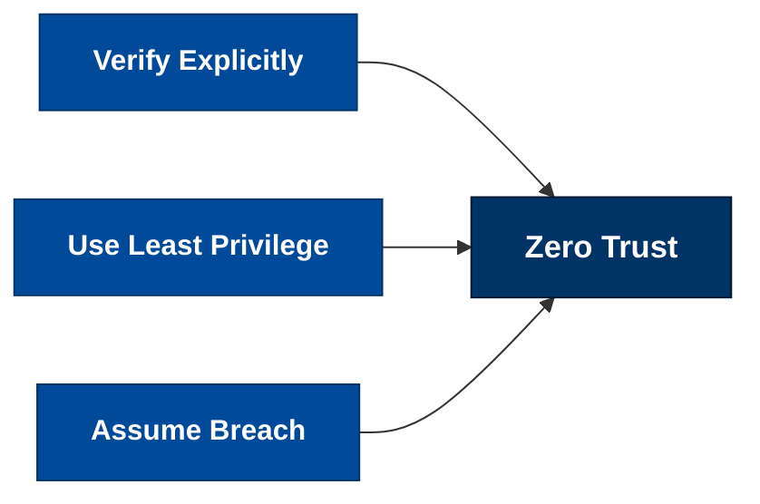
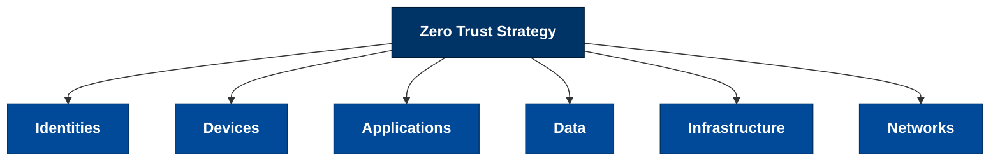
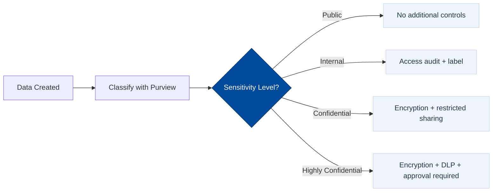
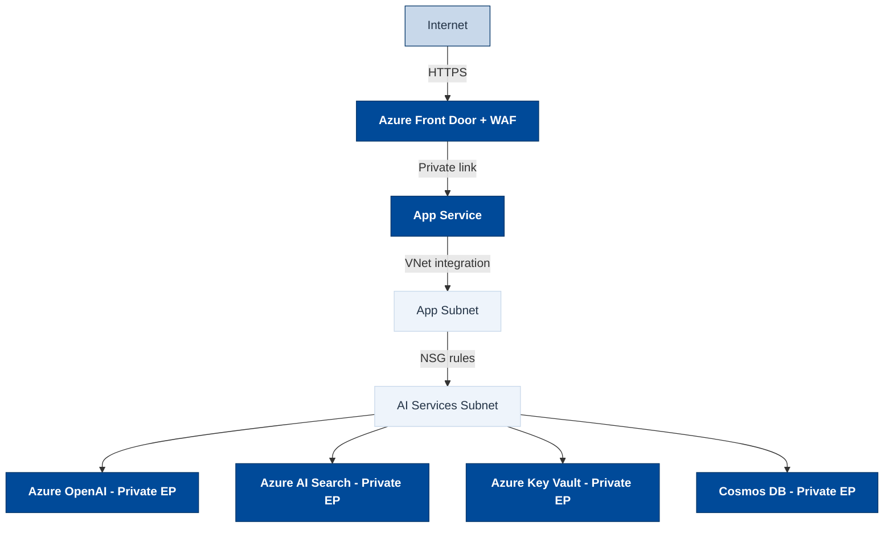
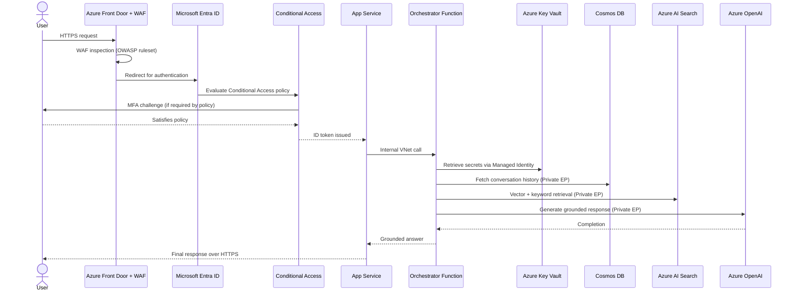

# Zero Trust Architecture

----------

<b>References</b> (Click to expand)

- [Zero Trust defined — Microsoft Security](https://www.microsoft.com/en-us/security/business/zero-trust)
- [Apply Zero Trust principles to Azure IaaS — Microsoft Learn](https://learn.microsoft.com/en-us/security/zero-trust/azure-infrastructure-overview)
- [Zero Trust Essentials eBook](https://cdn-dynmedia-1.microsoft.com/is/content/microsoftcorp/microsoft/final/en-us/microsoft-brand/documents/zero-trust-essentials-ebook.pdf)
- [Conditional Access overview — Microsoft Learn](https://learn.microsoft.com/en-us/entra/identity/conditional-access/overview)
- [Azure Private Link and Private Endpoints](https://learn.microsoft.com/en-us/azure/private-link/private-endpoint-overview)
- [Defender for Cloud introduction](https://learn.microsoft.com/en-us/azure/defender-for-cloud/defender-for-cloud-introduction)
- [Microsoft Purview — Data governance](https://learn.microsoft.com/en-us/purview/purview)
- [Microsoft Sentinel — SIEM/SOAR](https://learn.microsoft.com/en-us/azure/sentinel/overview)
- [GPT-RAG Zero Trust Architecture — Azure GitHub](https://github.com/Azure/GPT-RAG)

## What It Is

> Zero Trust is a security model built on one principle: `never trust, always verify`. Unlike traditional perimeter-based security — which assumes everything inside a corporate network is safe — `Zero Trust treats every request as potentially hostile, regardless of where it originates`.

Traditional security drew a hard boundary around the network and trusted everything inside it. That boundary no longer exists in a meaningful way — users work from anywhere, data lives in SaaS apps and cloud storage, and services call other services across public and private channels. The perimeter dissolved, but the risks did not.

Zero Trust responds to this reality by `moving trust decisions from the network level to the request level`. Every request — human or machine — must prove who it is, where it comes from, what device it uses, and whether that combination is allowed under current policy. Nothing is assumed safe.

> From [Microsoft Security](https://www.microsoft.com/en-us/security/business/zero-trust): _"Instead of assuming everything behind the corporate firewall is safe, the Zero Trust model assumes breach and verifies each request as though it originates from an open network."_

## The Three Guiding Principles

### Verify Explicitly

`Always authenticate and authorize based on all available data points`: identity, location, device health, service context, data classification, and behavioral anomalies. Never grant access based on network location alone.

In practice this means every API call, every user login, and every service-to-service interaction carries a verifiable identity token, and that token is evaluated against a live policy every time — not cached at the edge.

### Use Least Privilege Access

`Limit access with just-in-time (JIT) and just-enough-access (JEA)`. Users and workloads receive only the permissions needed for the current task. When the task ends, the permission expires.

This limits the blast radius of a compromised credential. An attacker who steals a token gets only what that token could access — not the entire environment.

### Assume Breach

`Design as if a breach has already happened`. Micro-segment networks so lateral movement is impossible. Encrypt end-to-end so intercepted traffic is useless. Log everything so you can detect, investigate, and recover.

!!! warning
    Most security incidents are not prevented at the perimeter — they are detected too late after an attacker has been moving laterally for weeks. Assume Breach forces you to shrink the detection and response window, not just harden the front door.

## The Six Pillars

Zero Trust is applied across six interconnected security domains. No single control is sufficient — all six reinforce each other.

| Pillar | What Is Protected | Key Controls |
|--------|------------------|--------------|
| **Identities** | Users, service accounts, managed identities, IoT | MFA, Conditional Access, Privileged Identity Management (PIM) |
| **Devices** | Endpoints, servers, developer workstations | Intune compliance policies, Defender for Endpoint, device health checks |
| **Applications** | SaaS, on-prem apps, custom APIs | App registrations, permission scopes, OAuth 2.0 / OIDC flows |
| **Data** | Files, databases, structured and unstructured data | Purview sensitivity labels, encryption at rest and in transit, DLP |
| **Infrastructure** | VMs, containers, Kubernetes, serverless functions | Defender for Cloud, JIT VM access, hardened OS images |
| **Networks** | VNets, subnets, internet ingress/egress | NSGs, Azure Firewall, Private Endpoints, micro-segmentation |

### Identities

Identity is the new perimeter. `Every user, application, and workload should authenticate with a verifiable identity`, and that identity should be evaluated against risk signals before access is granted.

Key Azure tools:

- **Microsoft Entra ID** — the identity platform. Handles authentication, token issuance, and directory services.
- **Conditional Access** — policy engine that evaluates risk signals (location, device state, sign-in risk) and decides whether to allow, block, or challenge with MFA.
- **Privileged Identity Management (PIM)** — enforces JIT for privileged roles. An admin requests elevation, gets it for a time-boxed window, and the role expires automatically.
- **Managed Identity** — removes human-managed credentials from the equation entirely. Azure services authenticate to each other using platform-issued identities with no stored secrets.

### Devices

A valid identity from an unmanaged or compromised device should not be trusted. `Device health is a required input to access decisions`, not an afterthought.

- **Microsoft Intune** — enforces compliance policies: encryption, OS version, antivirus state, screen lock.
- **Microsoft Defender for Endpoint** — endpoint detection and response. Feeds device risk signals directly into Conditional Access.
- **Hybrid Entra Join / Entra Join** — devices registered with Entra ID so their health state is known at policy evaluation time.

### Applications

Applications must enforce their own authorization, not rely on network location. `Each application should require scoped, least-privilege access to any downstream resource`.

- OAuth 2.0 scopes and app roles limit what a token allows.
- Admin consent restricts which permissions apps can request.
- Managed Identity eliminates service account passwords for app-to-service authentication.

### Data

Data is the ultimate target of any attack. `Data must be classified, labeled, and protected regardless of where it lives` — on-premises, in cloud storage, in SaaS apps, or in transit.

### Infrastructure

Infrastructure — whether VMs, containers, or serverless functions — must be continuously assessed for vulnerabilities and hardened against attack.

- **Defender for Cloud** — gives a unified security posture score, surfaces misconfigurations, and provides JIT VM access so management ports are not permanently open.
- **Hardened base images** — start from a known-good state rather than patching a default image.
- **Infrastructure-as-Code scanning** — Bicep/Terraform templates scanned for misconfigurations before deployment.

### Networks

A Zero Trust network design ensures that `even if an attacker enters one segment, they cannot reach another`. Lateral movement is blocked at the network layer.

> `Every backend service is reachable only via a Private Endpoint inside the VNet — no public internet exposure for AI Search, Azure OpenAI, Key Vault, or Cosmos DB`.

## How a Request Flows Through Zero Trust

From a user typing a question in a RAG chatbot to an answer appearing on screen — every step crosses a Zero Trust verification gate:

!!! note
    Notice that `Managed Identity` is used for the Orchestrator-to-Key Vault call. There is no stored password or API key — Azure issues a short-lived credential at runtime, and Key Vault validates it directly against the Entra ID token.

## Zero Trust Applied to Enterprise RAG

When a RAG system moves from a demo environment to enterprise production, Zero Trust controls are required at every layer. The table below maps each RAG component to its Zero Trust enforcement:

| RAG Component | Zero Trust Control |
|---------------|-------------------|
| **User queries** | Entra ID authentication + MFA + Conditional Access policy before any query reaches backend |
| **Retrieval index (AI Search)** | Private Endpoint only — no public internet access; Managed Identity for orchestrator access |
| **Language model (Azure OpenAI)** | Private Endpoint — API key never exposed; accessed via Managed Identity |
| **Document storage (Blob / SharePoint)** | Sensitivity labels, least-privilege service principal, no shared access signatures in code |
| **Orchestrator (Azure Functions)** | VNet-integrated, Managed Identity, no hardcoded credentials, outbound only via NSG rules |
| **Conversation history (Cosmos DB)** | Private Endpoint, RBAC role assignment, encryption at rest and in transit |
| **Secrets (API keys, connection strings)** | Azure Key Vault — zero hardcoded secrets in code, environment variables, or config files |
| **Logs and monitoring** | All access events flow to Azure Monitor + Microsoft Sentinel; alerts on anomalous patterns |

## Deployment Maturity

Zero Trust adoption is a journey. Microsoft defines three maturity stages. Most organizations start at Traditional and incrementally improve:

| Stage | Identity | Network | Data | Monitoring |
|-------|----------|---------|------|------------|
| **Traditional** | Password-only, broad roles | VPN + perimeter firewall, flat network | Unclassified, minimal encryption | Basic logs, reactive response |
| **Advanced** | MFA enforced, some conditional access | Some segmentation, private endpoints for key services | Sensitivity labels on key data, encryption in transit | Centralized logs, some alerting |
| **Optimal** | Passwordless, full conditional access, JIT/PIM | Full micro-segmentation, all services on private endpoints, no public exposure | All data classified, DLP enforced, encryption everywhere | Real-time threat detection, automated response via Sentinel |

!!! tip
    Start with **Identities** — enforcing MFA and Conditional Access gives the highest security return for the least operational disruption. Layer in network controls (Private Endpoints) next, then data classification and monitoring.

!!! note
    For an enterprise RAG system, reaching the Optimal stage typically means: all backend services on Private Endpoints, zero public API keys in code, Managed Identity for all service-to-service auth, all logs flowing to Sentinel, and data classified and labeled with Purview.
