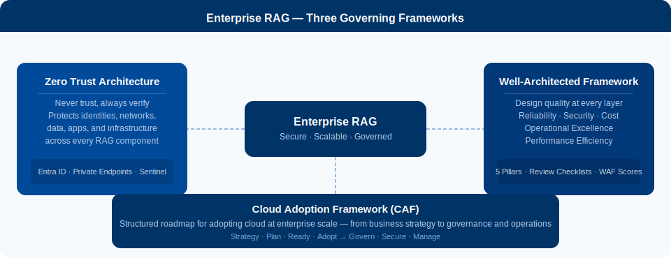

# RAG Enterprise Scale

----------

Enterprise guidance for designing, securing, and operating Retrieval-Augmented Generation workloads on Azure.

This documentation focuses on how to move from RAG proof-of-concept to production deployment with:

- Zero Trust security controls
- Cloud governance and landing zones
- Well-Architected design decisions for reliability, cost, and performance

## Where to start

	<a class="home-card" href="01-fundamentals/">
		<h3>01.1 Enterprise RAG Overview</h3>
		
What Enterprise RAG means in Microsoft guidance, and how ZTA, CAF, and WAF fit together.

	</a>

	<a class="home-card" href="02-catalog/">
		<h3>01.2 Implementation Approaches</h3>
		
Delivery approaches from initial enablement to production-ready operating model.

	</a>

	<a class="home-card" href="03-enterprise-design/architecture-patterns/">
		<h3>02.1 Architecture Patterns</h3>
		
Reference patterns for network isolation, data access, and scaling options.

	</a>

	<a class="home-card" href="03-enterprise-design/governance-security/">
		<h3>02.2 Governance and Security</h3>
		
Policy, identity, compliance, and operational controls for enterprise AI workloads.

	</a>

	<a class="home-card" href="04-security/">
		<h3>03.1 Zero Trust Architecture</h3>
		
Security model, Azure implementation guidance, and practical maturity path.

	</a>

## Platform model

	

## Recommended reading order

1. [Enterprise RAG Overview](01-fundamentals/index.md)
2. [Zero Trust Architecture](04-security/index.md)
3. [Governance and Security](03-enterprise-design/governance-security.md)
4. [Architecture Patterns](03-enterprise-design/architecture-patterns.md)
5. [Implementation Approaches](02-catalog/index.md)

!!! tip
    If you are preparing a new deployment, begin with the Enterprise RAG overview and align your landing zone decisions before selecting implementation patterns.
